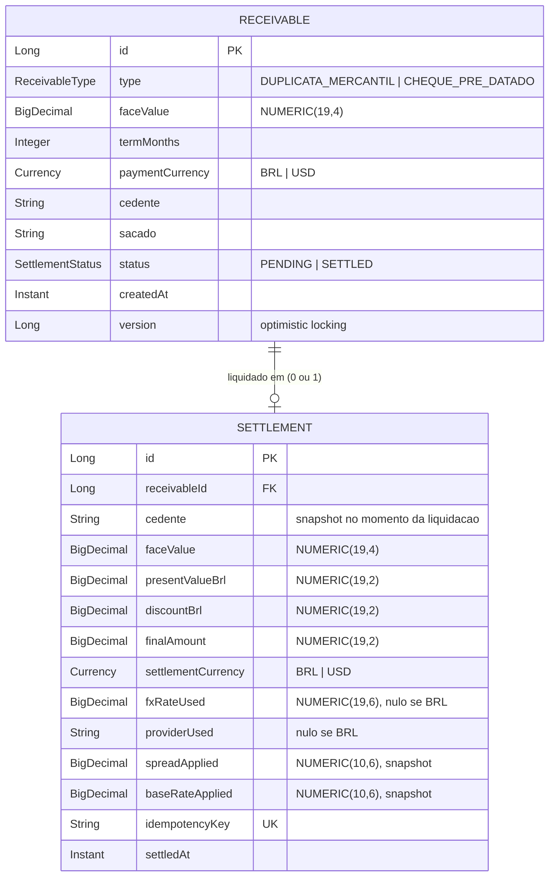
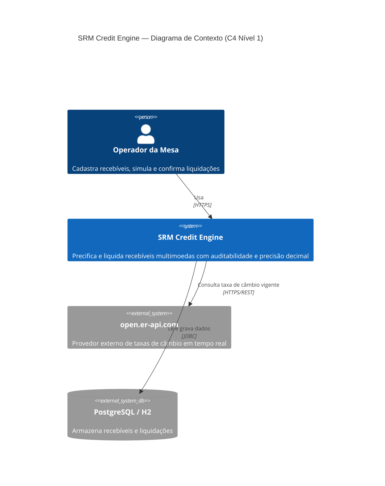
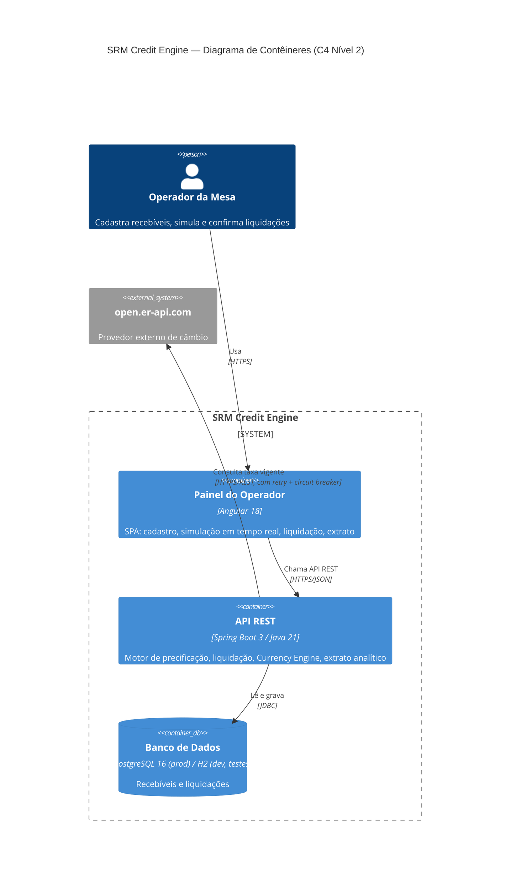

# DIAGRAMS.md — SRM Credit Engine

Diagramas exigidos pelo desafio técnico: ER básico (nível Júnior, seção 6) e C4
níveis 1 e 2 (nível Sênior, seção 6). Renderizados via Mermaid — visíveis
diretamente no GitHub, sem ferramenta externa.

---

## Diagrama ER (Entidade-Relacionamento)

**Notas de design:**

- **`RECEIVABLE ||--o|  SETTLEMENT`** (um-para-zero-ou-um): um recebível **pode** ter
  no máximo uma liquidação — nunca duas (regra de negócio: `409 Conflict` se já
  `SETTLED`). Um recebível `PENDING` ainda não tem `Settlement` associado.
- **`SETTLEMENT.receivableId`** é uma referência lógica (FK), não um relacionamento
  JPA (`@ManyToOne`) — decisão deliberada: `Settlement` é um registro de auditoria
  **autocontido**, que não depende de navegar até `Receivable` para ter sentido (por
  isso `cedente`, `spreadApplied`, `baseRateApplied` são *snapshots* duplicados, não
  buscados via join).
- **`idempotencyKey`** tem constraint `UNIQUE` no banco — é essa restrição, não só a
  checagem em código, que garante idempotência sob concorrência real.
- **`version`** em `RECEIVABLE` é o campo do Optimistic Locking (`@Version`) — não
  existe em `SETTLEMENT`, porque `Settlement` nunca é atualizado após criado (sem
  setters, imutável).

---

## Diagrama C4 — Nível 1 (Contexto do Sistema)

---

## Diagrama C4 — Nível 2 (Contêineres)

**Notas de design:**

- O **Frontend** e o **Backend** são contêineres **separados** (repositórios
  distintos), mas ambos fazem parte do mesmo *System Boundary* lógico — reflete a
  decisão de monólito modular no backend (ver `DECISIONS.md`/ADR 0001), não
  microsserviços: um único contêiner de API, não vários.
- A seta do **Backend → open.er-api.com** já anota "retry + circuit breaker"
  diretamente no diagrama — é a resiliência descrita no `SPEC.md`, Seção 5,
  tornada visível na arquitetura, não só em texto.
- O banco aparece como **um único contêiner lógico** mesmo suportando dois motores
  (Postgres/H2) — a aplicação é agnóstica de banco por design (ver
  `DECISIONS.md`/ADR 0002).
